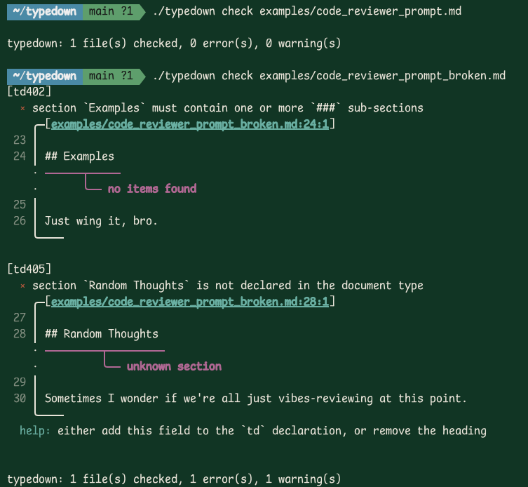

# typedown

**Statically typed markdown.** A lint + type checker + contract runtime
for markdown files aimed at agent-facing documents (prompts, tool specs,
runbooks, AGENTS.md).

Markdown is load-bearing infrastructure for LLMs now, but it's `any`-typed.
typedown gives it types — and now, through **effect rows**, a capability
contract that a runtime can enforce.

## Concept

Declare a document's type in frontmatter and author types inline with a
TypeScript-flavored DSL in ``` ```td ``` fences. The document's type is
both a **content shape** (what sections and values belong) and a **policy**
(what tools it may invoke, what paths it may read/write, which models it
was validated against):

`````md
---
typedown: Doc
---

# Code Reviewer

```td
import {
  Prompt, Uses, Reads, Writes, Model, MaxTokens,
} from "typedown/agents"

type ReviewInput  = { diff: string, context: string }
type ReviewOutput = { approved: boolean, comments: Comment[] }

interface Comment {
  file: string
  line: number
  severity: "nit" | "suggestion" | "blocking"
  body: string
}

export type Doc =
  & Prompt<ReviewInput, ReviewOutput>
  & Uses<["read_file", "run_tests"]>
  & Reads<["./src/**", "./tests/**"]>
  & Writes<[]>
  & Model<"claude-opus-4-5" | "claude-sonnet-4-5">
  & MaxTokens<4096>
```

## Role
You are a rigorous reviewer…

## Instructions
1. …

## Examples

### Example 1

**Input:**

```json
{ "diff": "…", "context": "src/auth.ts" }
```

**Output:**

```json
{ "approved": false, "comments": [
  { "file": "src/auth.ts", "line": 42,
    "severity": "blocking", "body": "null check missing" }
] }
```
`````

Run `typedown check docs/` and the checker verifies:

- every field of the declared shape has a `##` heading
- `## Instructions` body is actually an ordered list
- `## Examples` contains `### Example N` sub-sections
- each example has `Input:` and `Output:` markers
- **every `json` / `yaml` value fence in an example is type-checked
  against the declared `I` / `O`** — wrong primitives, missing required
  fields, enum violations, malformed JSON all get pinpointed diagnostics
- no undeclared `##` sections slip in
- every effect row (`Uses`, `Reads`, `Writes`, `Model`, `MaxTokens`) is
  well-formed — tuple args of the right shape, number literals for
  ceilings, and so on

## Example



## Layout

```
crates/
  td-core/     diagnostics + spans
  td-ast/      markdown & td-DSL ASTs
  td-parse/    markdown parser + td-DSL parser
  td-check/    type env, conformance, value typing, effect rows,
               pipeline composition, JSON Schema
  td-stdlib/   built-in types (Section, Prose, Prompt, Tool, Runbook,
               Uses, Reads, Writes, Model, MaxTokens, Compose, …)
  td-runtime/  EnforcedPrompt: refuse unauthorized tool calls / reads / writes
               at runtime from a typed-markdown contract; expose pipeline
               structure to orchestrators
  td-cli/      `typedown` binary: check / types / export / effects / pipeline
```

## Usage

```sh
cargo run -p td-cli -- check examples/
cargo run -p td-cli -- types                             # print stdlib modules
cargo run -p td-cli -- export examples/foo.md            # JSON Schema → stdout
cargo run -p td-cli -- export examples/foo.md -o out.json
cargo run -p td-cli -- effects examples/foo.md           # print the policy
cargo run -p td-cli -- effects examples/foo.md --json
cargo run -p td-cli -- pipeline examples/pipeline.md     # print pipeline steps
cargo run -p td-cli -- pipeline examples/pipeline.md --json
```

## Typed example values

`Example<I, O>` is now load-bearing. Write your examples with `json` or
`yaml` value fences and typedown type-checks the payloads against `I` / `O`:

````md
### Example 1

**Input:**

```json
{ "diff": "...", "context": "src/auth.ts" }
```

**Output:**

```yaml
approved: false
comments:
  - file: src/auth.ts
    line: 42
    severity: blocking
    body: null check missing
```
````

Prose-only examples (no value fences) continue to work — value typing is
strictly opt-in.

## Typed composition — pipelines where I/O and effects flow statically

Single prompts are atoms; real agents are graphs of prompts calling
prompts calling tools. `Compose<[…]>` types that graph end-to-end:

```ts
import { Prompt, Uses, Model, MaxTokens } from "typedown/agents"
import { Compose } from "typedown/workflows"

type Classify =
  & Prompt<Query, Classification>
  & Uses<[]>
  & Model<"openai/gpt-4o-mini">
  & MaxTokens<512>

type Answer =
  & Prompt<Classification, Response>
  & Uses<["retrieve_kb"]>
  & Model<"anthropic/claude-sonnet-4.5">
  & MaxTokens<2048>

// The pipeline's type is both the plan AND the policy ceiling.
export type Pipeline =
  & Compose<[Classify, Answer]>
  & Uses<["retrieve_kb"]>
  & Model<"openai/gpt-4o-mini" | "anthropic/claude-sonnet-4.5">
  & MaxTokens<4096>
```

`typedown check` verifies:

1. **I/O flow.** `Classify`'s output (`Classification`) must be
   structurally equivalent to `Answer`'s input. Rename a field, change
   a type, reorder the steps without updating the adjacent one — you
   get a pinpointed **td702** on the PR that introduces it.
2. **Effect-row algebra.** Every child's effects must fit inside the
   pipeline's declared ceiling:
   - `∪ child.Uses   ⊆ parent.Uses`   (**td703**)
   - `∪ child.Reads  ⊆ parent.Reads`  (**td703**)
   - `∪ child.Writes ⊆ parent.Writes` (**td703**)
   - each `child.Model  ⊆ parent.Model` (**td704**)
   - each `child.MaxTokens ≤ parent.MaxTokens` (**td705**)

You cannot accidentally compose a subagent that uses a tool the parent
didn't authorize. The type system refuses before runtime.

Inspect a pipeline with the CLI:

```sh
typedown pipeline prompts/pipeline.md
# prompts/pipeline.md — pipeline (2 steps)
#   [1] Classify
#       input:      Query
#       output:     Classification
#       uses:       ∅ (deny-all)
#       model:      openai/gpt-4o-mini
#       max tokens: 512
#   [2] Answer
#       input:      Classification
#       output:     Response
#       uses:       retrieve_kb
#       ...
```

Schema export embeds the full pipeline as an `x-typedown-pipeline`
vendor extension alongside `x-typedown-effects`, so orchestrators
(AI SDK codegen, Workflow DevKit, a custom runner) get stepwise I/O +
per-step policy in one document.

## Effect rows — prompts as contracts

A typed prompt's declared type can carry a **capability policy** alongside
its content shape. Five markers ship in `typedown/agents`:

| marker           | meaning                                                     |
|------------------|-------------------------------------------------------------|
| `Uses<T>`        | tuple of tool names this prompt may invoke                  |
| `Reads<T>`       | tuple of glob patterns this prompt may read                 |
| `Writes<T>`      | tuple of glob patterns this prompt may write                |
| `Model<T>`       | tuple or string-union of model identifiers it was validated against |
| `MaxTokens<N>`   | number literal: hard ceiling the runtime enforces           |

You opt in by intersecting them into the document's declared type:

```ts
export type Doc =
  & Prompt<In, Out>
  & Uses<["read_file", "run_tests"]>
  & Reads<["./src/**", "./tests/**"]>
  & Writes<[]>                                  // explicit: cannot write
  & Model<"claude-opus-4-5" | "claude-sonnet-4-5">
  & MaxTokens<4096>
```

Effects flow all the way through the toolchain:

- `typedown check` validates effect-row arguments (tuples of string
  literals, numbers for `MaxTokens`, etc.) — malformed rows fire **td601**.
- `typedown export` emits them as the `x-typedown-effects` vendor
  extension on the root JSON Schema, so downstream consumers (OpenAPI,
  provider tool-call specs, etc.) preserve the policy.
- `typedown effects <file>` prints the declared policy table — useful for
  quick audits.
- `td-runtime`'s `EnforcedPrompt` refuses unauthorized tool calls,
  reads, writes, models, and over-budget token requests, and validates
  concrete JSON input/output against `I` and `O`.

### Runtime enforcement (`td-runtime`)

```rust
use td_runtime::EnforcedPrompt;

let prompt = EnforcedPrompt::load("prompts/reviewer.md")?;

// Before letting the model invoke a tool, ask the contract.
prompt.authorize_tool("read_file")?;                    // Ok
prompt.authorize_tool("shell_exec").unwrap_err();       // deny

// Path policy is compiled to a GlobSet at load time.
prompt.authorize_read("./src/auth/user.ts")?;           // Ok
prompt.authorize_write("./src/auth/user.ts").unwrap_err(); // Writes<[]>

// Input / output validation uses the same judgement as `typedown check`.
prompt.validate_input(&serde_json::json!({
    "diff": "...", "context": "src/auth.ts",
}))?;

prompt.check_token_limit(4096)?;                        // Ok
prompt.check_token_limit(4097).unwrap_err();            // over ceiling
```

`EnforcedPrompt::load` **refuses to construct** if the doc wouldn't pass
`typedown check`. Silently enforcing an empty policy on a broken contract
is a security anti-pattern.

## Diagnostic codes

| code   | severity | meaning                                          |
|--------|----------|--------------------------------------------------|
| td101  | error    | syntax error in ` ```td ` fence                  |
| td201  | error    | duplicate type declaration                       |
| td202  | error    | imported module not found                        |
| td203  | error    | symbol not exported from module                  |
| td299  | error    | internal: stdlib module failed to parse          |
| td301  | warning  | frontmatter missing `typedown:` field            |
| td401  | error    | required section is missing                      |
| td402  | error    | section body does not match expected type        |
| td403  | error    | unknown type referenced in declaration           |
| td404  | error    | document type must be an object                  |
| td405  | warning  | undeclared section present in document           |
| td501  | error    | value fence failed to parse (JSON / YAML syntax) |
| td502  | error    | value does not match declared type               |
| td504  | warning  | value has extra field not declared in the type   |
| td601  | error    | malformed effect row (bad argument shape)        |
| td701  | error    | pipeline step doesn't resolve to `Prompt<I, O>`  |
| td702  | error    | pipeline I/O mismatch (Out[N] ≠ In[N+1])         |
| td703  | error    | child Uses/Reads/Writes not in pipeline ceiling  |
| td704  | error    | child `Model<>` not in pipeline's model set      |
| td705  | error    | child `MaxTokens<>` exceeds pipeline ceiling     |

## Stdlib

Two modules ship out of the box:

- **`typedown/agents`** —
  - Content types: `Prompt<I, O>`, `Tool<A, R>`, `Runbook`, `Example<I, O>`
  - Effect rows: `Uses<T>`, `Reads<T>`, `Writes<T>`, `Model<T>`, `MaxTokens<N>`
- **`typedown/docs`** — `Readme`, `AgentsMd`
- **`typedown/workflows`** — `Compose<Steps>`, `Sequential<Steps>`
  (typed multi-step pipelines with effect-row algebra)

Plus implicit content-shape primitives usable without import:
`Section<T>`, `Prose`, `OrderedList`, `UnorderedList`, `TaskList`,
`CodeBlock<Lang>`, `Heading<Level>`.

## Status

Shipping today:
- Markdown + td-DSL parsing (intersections, unions, tuples, generics,
  TS-style leading `&` / `|` operators)
- Generic instantiation & intersection flattening
- Full conformance check for `Prompt<I, O>` and `Readme` / `AgentsMd`
- **Value typing**: JSON / YAML fences inside `Example<I, O>` are parsed
  and checked against `I` / `O` — generic parameters are no longer phantom
- **Schema export**: `typedown export` emits JSON Schema (Draft 2020-12)
  with every local type declaration under `$defs` and effect rows under
  `x-typedown-effects`
- **Effect rows**: `Uses<>`, `Reads<>`, `Writes<>`, `Model<>`,
  `MaxTokens<>` intersected into the doc's type declare a capability
  policy surface
- **Typed composition**: `Compose<[A, B, C]>` statically checks
  adjacent-step I/O flow AND enforces effect-row subset algebra so
  children must fit inside the pipeline's ceiling
- **`td-runtime`**: `EnforcedPrompt::load` refuses unauthorized tool
  calls, reads, writes, models, and over-budget token requests;
  validates concrete JSON I/O against `I` and `O`; exposes pipeline
  structure for orchestrators
- CLI: `check` / `types` / `export` / `effects` / `pipeline`

Roadmap:
- AI SDK / Workflow DevKit / Anthropic tool JSON compile targets
- `td diff` for semver-style compatibility checks between doc versions
- Additional export targets (`.d.ts`, Zod, OpenAI / Anthropic tool JSON)
- Reference Anthropic / OpenAI client wrappers that consume `EnforcedPrompt`
- LSP server (`td-lsp`) for in-editor diagnostics
- User-authored `.td` modules via import paths
- Executable code-fence checking (tsc / rustc / shellcheck on blocks)
- Watch mode, incremental parsing, formatter

## License

MIT OR Apache-2.0
